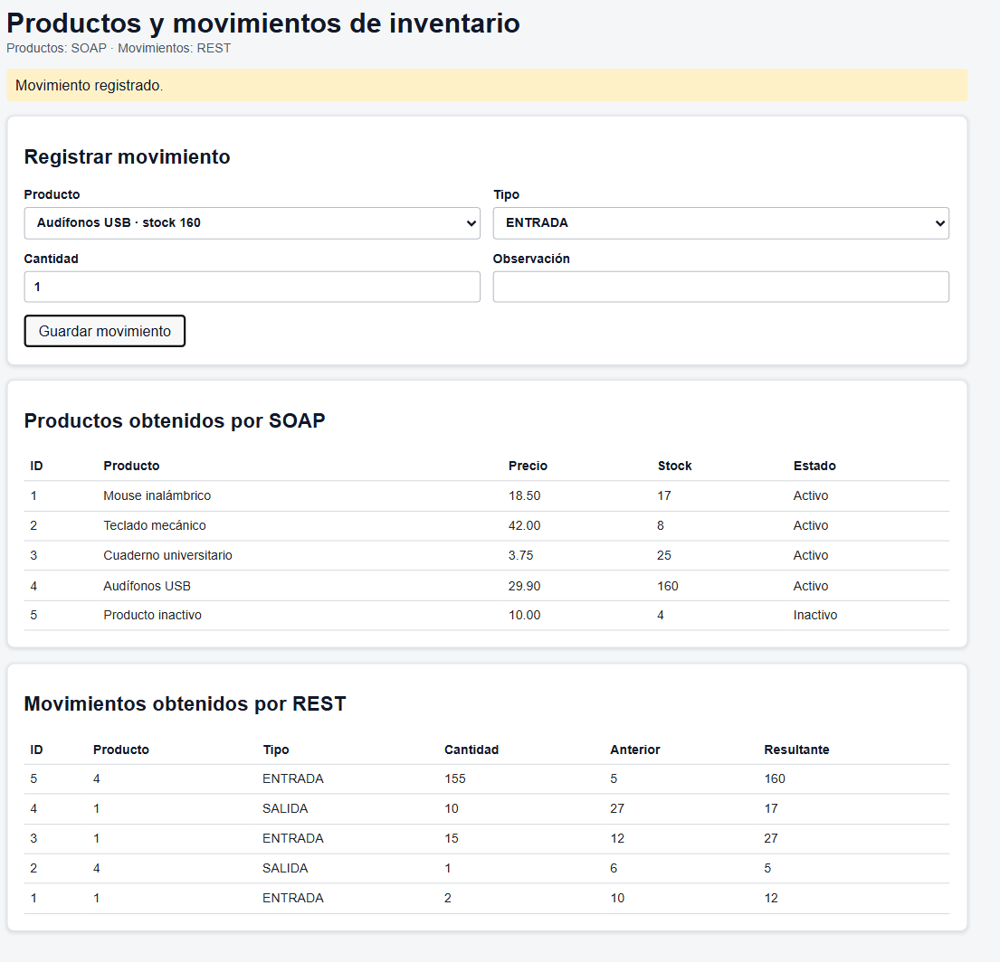

# EXAMEN FINAL

**JORDY ALEXANDER NAVARRO TELLO**  
**TERCERO A MATUTINA**  
**Programación Web I - Tercer Bimestre**

## Guía paso a paso

### Paso 1. Abrir la carpeta del proyecto

Abrir la carpeta `Practico_EF3_3A_Matutino_Productos`.

### Paso 2. Preparar SQL Server

1. Abrir SQL Server Management Studio.
2. Conectarse a `localhost\SQLEXPRESS`.
3. Ejecutar `SQL/EF3_Productos_Movimientos.sql`.
4. Confirmar que existe la base `EF3ProductosDB` con productos.

La conexión configurada por defecto es:

`Server=localhost\SQLEXPRESS;Database=EF3ProductosDB;Trusted_Connection=True;TrustServerCertificate=True;`

Si la instancia es diferente, cambiar `DefaultConnection` en `ProductosSOAP/appsettings.json` y `MovimientosREST/appsettings.json`.

### Paso 3. Ejecutar ProductosSOAP

1. Abrir `ProductosSOAP/ProductosSOAP.csproj` en Visual Studio.
2. Seleccionar el perfil **HTTP**.
3. Presionar **Iniciar**.
4. Comprobar el servicio en `http://localhost:5163/ProductoService.svc`.

El WSDL está en `http://localhost:5163/ProductoService.svc?wsdl`. Que se muestre como XML es normal.

### Paso 4. Ejecutar MovimientosREST

1. Abrir `MovimientosREST/MovimientosREST.csproj` en Visual Studio.
2. Seleccionar el perfil **HTTP**.
3. Presionar **Iniciar**.
4. Usar como URL base `http://localhost:5265`.

Endpoints disponibles:

- `GET http://localhost:5265/api/MovimientoInventario`
- `GET http://localhost:5265/api/MovimientoInventario/1`
- `GET http://localhost:5265/api/MovimientoInventario/producto/1`
- `POST http://localhost:5265/api/MovimientoInventario`

El POST consulta el producto mediante SOAP, valida el movimiento, actualiza el stock y guarda el registro.

### Paso 5. Ejecutar Angular

Para iniciar solo Angular:

1. Abrir la carpeta `productos-angular`.
2. Ejecutar `abrir-angular.bat` con doble clic.
3. Esperar el mensaje `http://localhost:4200/`.
4. Abrir `http://localhost:4200`.

También se puede usar una terminal dentro de `productos-angular`:

```text
npm install
npm start
```

`node_modules` permanece en el ordenador para ejecutar Angular, pero está excluido de GitHub.

Para iniciar SOAP, REST y Angular juntos, ejecutar desde la carpeta principal `abrir-productos-angular.bat`. No ejecutarlo si los servicios ya están abiertos.

### Paso 6. Verificar Angular

La pantalla debe mostrar los productos recibidos desde SOAP con ID, nombre, precio, stock y estado. También debe mostrar el formulario de movimientos y la tabla de movimientos recibidos desde REST.

### Paso 7. Probar con Postman

1. Abrir Postman.
2. Importar `Postman/POSTMAN_MovimientosREST.postman_collection.json`.
3. Confirmar que MovimientosREST esté ejecutándose en el puerto `5265`.
4. Ejecutar las solicitudes de la colección.

También se puede abrir con `Postman/abrir-productos-postman.bat`.

La colección prueba listar, consultar por ID, consultar por producto, registrar entradas y salidas, y validar cantidad cero, tipo incorrecto, producto inexistente, producto inactivo y stock insuficiente.

Los POST válidos modifican el stock y agregan un movimiento en la base de datos.

## Resultado visual de Angular

La aplicación funcionando se visualiza así:



## Reglas cumplidas del examen

- El GET por producto devuelve únicamente sus movimientos.
- Si no existen movimientos, responde con un código HTTP apropiado.
- El POST usa el producto administrado por ProductosSOAP.
- Se usa el stock SOAP como `StockAnterior` y se calcula `StockResultante`.
- Solo se aceptan `ENTRADA` y `SALIDA`.
- No se permite stock negativo ni salidas superiores al stock disponible.
- Angular usa el servicio REST existente para registrar movimientos.
- Angular procesa la respuesta XML de SOAP y obtiene `IdProducto` y `Nombre`.
- No se creó un segundo servicio REST.

## Archivos importantes

- `README.md`: guía completa paso a paso.
- `docs/captura-angular.png`: captura de la aplicación Angular funcionando.
- `LEEME_EJECUCION.txt`: instrucciones resumidas.
- `abrir-productos-angular.bat`: inicia todo el proyecto.
- `productos-angular/abrir-angular.bat`: inicia solo Angular.
- `Postman/POSTMAN_MovimientosREST.postman_collection.json`: pruebas REST.
- `SQL/EF3_Productos_Movimientos.sql`: base de datos y datos iniciales.

## Solución de problemas

### Angular muestra `ERR_CONNECTION_REFUSED`

Angular no está ejecutándose. Iniciar `productos-angular/abrir-angular.bat` y abrir nuevamente `http://localhost:4200`.

### Aparece `C:\Program` no se reconoce

Usar los archivos `.bat` actualizados del proyecto, que manejan correctamente las rutas con espacios de `Program Files`.

### No aparecen productos

Comprobar que SQL Server, ProductosSOAP, MovimientosREST y Angular estén ejecutándose en los puertos `5163`, `5265` y `4200`.

### El puerto está ocupado

Cerrar la ventana del servicio que ya está ejecutándose o reiniciar Visual Studio antes de iniciar nuevamente.
